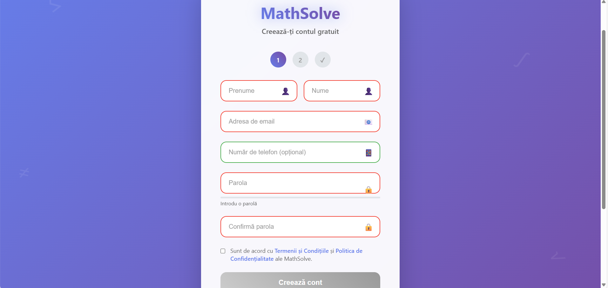
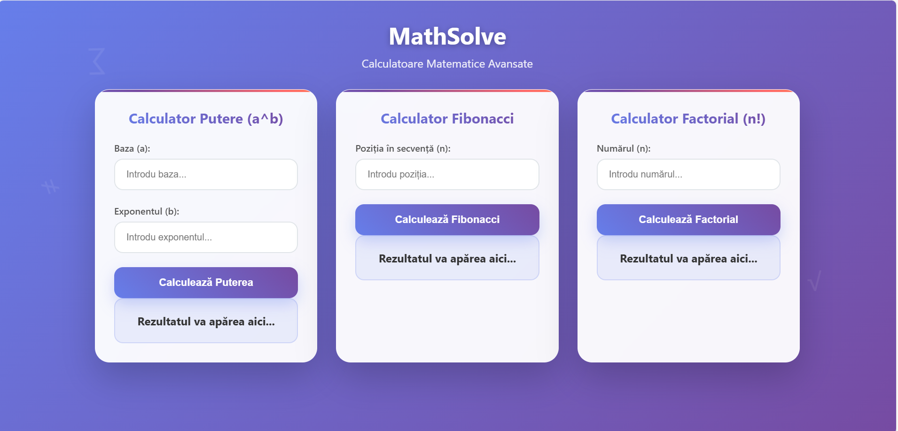

# Math Operations API

## Description

This project is a modular web application built with Flask, offering mathematical operations (power, factorial, Fibonacci), JWT authentication, event logging to Kafka, Redis caching, Prometheus metrics, and MySQL data persistence. It includes a modern web interface for users and APIs for mathematical operations.

## Technologies Used
- Python 3.10+
- Flask
- MySQL
- Redis
- Kafka & Zookeeper
- Docker & Docker Compose
- Prometheus
- Pydantic (request validation)
- Werkzeug (password hashing)
- JWT (PyJWT)

## Project Structure
```
app/
  controller/         # Logic for authentication, math operations, registration
  model/              # Database interaction (users, operations)
  routes/             # Flask routes (API and pages)
  schemas/            # Pydantic schemas for request/response validation
  utils/              # Utilities: JWT, Kafka, cache, etc
  view/               # HTML, JS, CSS for frontend
  logger.log          # Technical logs
  kafka_consumed.log  # Business/event logs from Kafka
requirements.txt      # Python dependencies
Dockerfile            # Backend image build
```

## Main Features
- **Authentication and registration** with JWT, AJAX validation, toast messages
- **Math operations**: power, factorial, Fibonacci (REST API)
- **Persistence**: users and operations in MySQL
- **Caching**: operation results with Redis
- **Event logging**: Kafka producer (on key actions), consumer (writes to file)
- **Prometheus metrics**: `/metrics` endpoint for monitoring
- **Log streaming**: endpoint for the last N lines from the Kafka log
- **Modern frontend**: HTML pages with AJAX, instant feedback

## How to Run the Project (locally with Docker Compose)
1. Clone the repo and enter the directory:
   ```sh
   git clone <repo-url>
   cd Math-operations
   ```
2. Start all services:
   ```sh
   docker-compose up --build
   ```
3. Access the app at `http://localhost:5000/mathSolve/login`

## Main Endpoints
- `/mathSolve/login` and `/mathSolve/register` — authentication and registration
- `/mathSolve/power`, `/mathSolve/fibonacci`, `/mathSolve/factorial` — POST API for math operations
- `/metrics` — Prometheus metrics
- `/stream-logs` — Kafka log streaming

## Environment Variable Configuration
- `SECRET_KEY` — JWT secret key (default: `dev_secret`)
- Set in `.env` or directly in Docker Compose

## Additional Notes
- For local development without Docker, install dependencies with `pip install -r requirements.txt` and start the required services (MySQL, Redis, Kafka) manually.
- The code is PEP8/flake8 compliant.

## Screenshots

Below are some screenshots of the application in action:
- Welcome Page
  
- Login Page:
  
- Registration Page:
  
- Calculator Page:
  


## Authors
-  Daria Craciun
